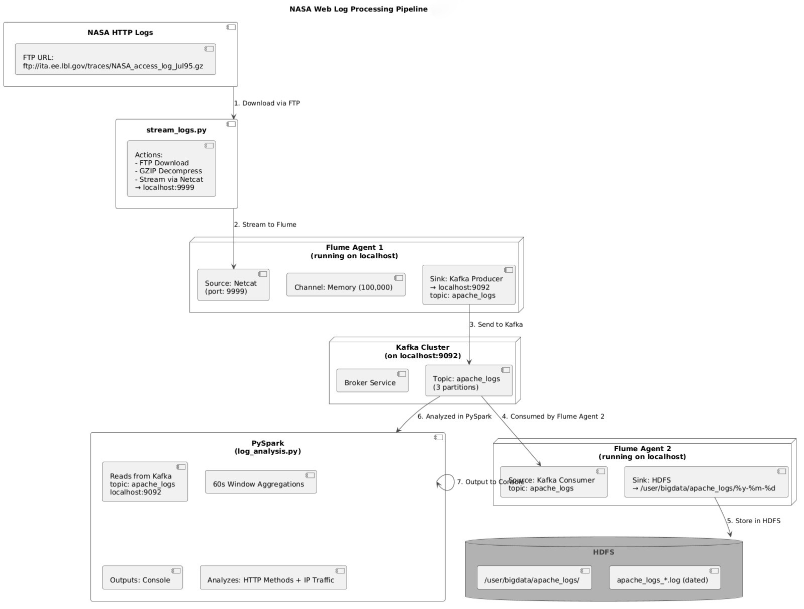

#  Real-Time Web Server Log Processing Pipeline with Apache Flume, Kafka, Spark & Hadoop

This project creates a robust end-to-end infrastructure to process *NASA-HTTP web server logs* using Apache’s Big Data tools:

-  *Flume* for ingestion  
-  *Kafka* for messaging  
-  *Spark* for real-time analysis  
-  *Hadoop* for storage  

The pipeline enables *real-time ingestion, processing, and storage, with **Spark Streaming* providing insights into traffic patterns and request methods.

---

##  Pipeline Architecture


---
###  *Flow Overview:*

1. *Data Ingestion*: Fetches NASA-HTTP logs from a remote source and streams them to Flume.
2. *Flume Agent 1*: Transfers logs to Kafka for reliable queuing.
3. *Kafka*: Manages log distribution as a message broker.
4. *Flume Agent 2*: Moves logs from Kafka to HDFS for storage.
5. *HDFS*: Stores logs persistently in a distributed filesystem.
6. *PySpark*: Analyzes logs in real-time with 60-second window aggregations.

---

##  Pipeline Structure

```text
Web Server Log Pipeline
├── Data Ingestion
│   ├── Source: NASA-HTTP Logs
│   │   └── URL: ftp://ita.ee.lbl.gov/traces/NASA_access_log_Jul95.gz
│   └── Script: stream_logs.py
│       ├── Downloads logs via FTP
│       ├── Decompresses GZIP file
│       └── Streams to Flume (Netcat on localhost:9999 with 0.1s delay)
├── Flume Agent 1
│   ├── Configuration: flume-agent1.conf
│   ├── Source: Netcat (localhost:9999)
│   ├── Channel: Memory (capacity: 100000)
│   └── Sink: Kafka (topic: apache_logs, servers: localhost:9092)
├── Kafka Messaging
│   ├── Topic: apache_logs
│   ├── Partitions: 3
│   └── Bootstrap Servers: localhost:9092
├── Flume Agent 2
│   ├── Configuration: flume-agent2.conf
│   ├── Source: Kafka (topic: apache_logs, consumer group: flume_consumer)
│   ├── Channel: Memory (capacity: 100000)
│   └── Sink: HDFS (path: /user/bigdata/apache_logs/%y-%m-%d)
├── HDFS Storage
│   ├── Directory: /user/bigdata/apache_logs
│   └── Files: apache_logs*.log (dated by %y-%m-%d)
└── PySpark Analysis
    ├── Script: log_analysis.py
    ├── Input: Kafka (topic: apache_logs)
    ├── Processing: 60-second window aggregations
    │   ├── Method Distribution (e.g., GET, POST)
    │   └── IP Traffic (counts by IP address)
    └── Output: Console (real-time analytics)
```

---

##  Project Files
```text
├── stream_logs.py          # Log streaming script
├── log_analysis.py         # Spark analysis script
├── flume-agent1.conf       # Netcat → Kafka config
└── flume-agent2.conf       # Kafka → HDFS config
```

---

##  Manual: Web Server Log Processing Pipeline

###  *Step-by-Step Setup Instructions*

### 1. *Prepare the Environment*

Install Apache Hadoop, Kafka, Flume, Spark, and Python (tested on CentOS 6.5).

---

### 2. *Start Services*

Start Hadoop DFS, ZooKeeper, Kafka server, and create the apache_logs Kafka topic:


## 🖥️ Example Output from PySpark

This section shows the output of the real-time log analysis performed by the log_analysis.py PySpark script.

### *Method Distribution*

Spark counts HTTP request methods (like GET, POST) over a sliding time window.

Batch: 

| window |method|count|
|------------------------------------------:|------:|-----:|
|[2025-05-06 00:27:00, 2025-05-06 00:28:00]| GET | 75 |
|[2025-05-06 00:26:00, 2025-05-06 00:27:00]| GET | 596 |


---

### *IP Traffic*

Spark identifies and counts the number of requests per IP address over each time window.

Batch: 

| window |ip |count|
|------------------------------------------:|---------------------------:|-----:|
|[2025-05-06 00:27:00, 2025-05-06 00:28:00]| sac1-109.calweb.com | 3 |
|[2025-05-06 00:27:00, 2025-05-06 00:28:00]| www-b6.proxy.aol.com | 2 |


---

## Notes

I encountered a Kafka version mismatch error while running the project. 
The log_analysis.py script needed to be updated to match the Kafka version (0.9.0.1). 
To resolve this, I exported the following environment variable before running Spark:

```bash
export PYSPARK_SUBMIT_ARGS='--packages org.apache.spark:spark-sql-kafka-0-10_2.11:2.4.5,org.apache.kafka:kafka-clients:0.9.0.1 pyspark-shell
```
